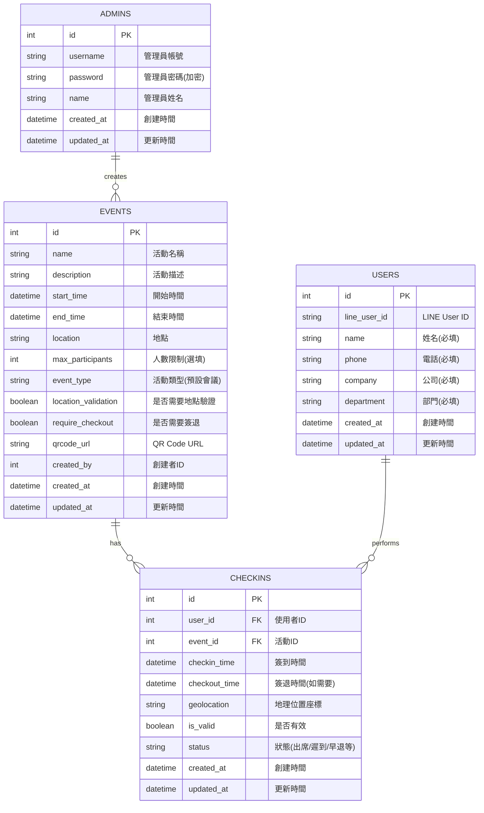

# CheckinFlow – 活動簽到系統

CheckinFlow 是一套結合 LINE Login 的活動簽到系統，支援活動 QRCode 簽到、時間驗證、LINE 綁定與後台管理。

## 🧩 功能特色

- 📆 建立活動並產生專屬 QR Code
- 🔒 使用者透過 LINE 掃碼登入（首次綁定基本資料）
- ✅ 已綁定者可一鍵打卡，限制一次簽到
- 🕒 僅允許在活動有效時間內打卡
- 📊 後台可查詢、匯出每日打卡紀錄
- 🌐 採用 Next.js 建構，支援全端開發

## 🔧 技術架構

- 前端框架：Next.js 15.3 (App Router)
- 狀態管理：Zustand / SWR
- 後端 API：Next.js API Routes / RESTful
- 認證機制：LINE Login 2.1（OAuth2）
- 資料儲存：MsSQL (TypeOrm)
- QRCode：qrcode.react / qrcode npm
- 時間驗證：Day.js + Server 時間比對

## 資料庫架構


## 🚀 快速啟動

```bash
# 安裝相依套件
yarn install

# 開發模式
yarn dev

# 初始化資料庫
db:init

# 環境變數
# 設置構建參數和環境變數
ENV DB_HOST=${DB_HOST}
ENV DB_PORT=${DB_PORT}
ENV DB_USERNAME=${DB_USERNAME}
ENV DB_PASSWORD=${DB_PASSWORD}
ENV DB_DATABASE=${DB_DATABASE}
ENV LINE_CHANNEL_ID=${LINE_CHANNEL_ID}
ENV LINE_CHANNEL_SECRET=${LINE_CHANNEL_SECRET}
ENV LINE_CALLBACK_URL=${LINE_CALLBACK_URL}
ENV NEXT_PUBLIC_LINE_CHANNEL_ID=${NEXT_PUBLIC_LINE_CHANNEL_ID}
ENV NEXT_PUBLIC_LINE_CALLBACK_URL=${NEXT_PUBLIC_LINE_CALLBACK_URL}
# Next.js 設定
ENV NEXT_PUBLIC_BASE_URL=${NEXT_PUBLIC_BASE_URL}
# JWT 設定
ENV JWT_SECRET=${JWT_SECRET}
# 首次登入帳號設定
ENV USERNAME=${USERNAME}
ENV PASSWORD=${PASSWORD}
## 預設帳號密碼 admin admin1532698

---

## 🧭 LINE 綁定 + 打卡流程圖（文字版）

### 使用者打卡流程：

```text
  使用者掃描活動 QRCode
          ↓
    開啟簽到頁面 (Next.js route)
          ↓
[✓] 檢查是否已綁定 LINE
        ↓ Yes                      ↓ No
   → 顯示打卡按鈕         → 跳轉 LINE Login（OAuth2）
        ↓                          ↓
   點擊打卡             成功登入 → 填寫基本資料 → 存入 DB 綁定
        ↓
比對活動時間是否合法
        ↓
儲存簽到紀錄（防止重複）
        ↓
顯示簽到成功畫面 🎉
```
