# CheckinFlow – 活動簽到系統

CheckinFlow 是一套結合 LINE Login 的活動簽到系統，支援活動 QRCode 簽到、時間驗證、LINE 綁定與後台管理。

## 🧩 功能特色

- 📆 建立活動並產生專屬 QR Code
- 🔒 使用者透過 LINE 掃碼登入（首次綁定基本資料）
- ✅ 已綁定者可一鍵打卡，限制一次簽到
- 🕒 僅允許在活動有效時間內打卡
- 📊 後台可查詢、匯出每日打卡紀錄
- 🌐 採用 Next.js 建構，支援全端開發

## 🔧 技術架構

- 前端框架：Next.js 14 (App Router)
- 狀態管理：Zustand / SWR
- 後端 API：Next.js API Routes / RESTful
- 認證機制：LINE Login 2.1（OAuth2）
- 資料儲存：MsSQL (TypeOrm)
- QRCode：qrcode.react / qrcode npm
- 時間驗證：Day.js + Server 時間比對

## 資料庫架構

```mermaid
erDiagram
    EVENTS {
        int id PK
        string name "活動名稱"
        string description "活動描述"
        datetime start_time "開始時間"
        datetime end_time "結束時間"
        string location "地點"
        int max_participants "人數限制(選填)"
        string event_type "活動類型(預設會議)"
        boolean location_validation "是否需要地點驗證"
        boolean require_checkout "是否需要簽退"
        string qrcode_url "QR Code URL"
        int created_by "創建者ID"
        datetime created_at "創建時間"
        datetime updated_at "更新時間"
    }
    
    USERS {
        int id PK
        string line_user_id "LINE User ID"
        string name "姓名(必填)"
        string phone "電話(必填)"
        string company "公司(必填)"
        string department "部門(必填)"
        datetime created_at "創建時間"
        datetime updated_at "更新時間"
    }
    
    ADMINS {
        int id PK
        string username "管理員帳號"
        string password "管理員密碼(加密)"
        string name "管理員姓名"
        datetime created_at "創建時間"
        datetime updated_at "更新時間"
    }
    
    CHECKINS {
        int id PK
        int user_id FK "使用者ID"
        int event_id FK "活動ID"
        datetime checkin_time "簽到時間"
        datetime checkout_time "簽退時間(如需要)"
        string geolocation "地理位置座標"
        boolean is_valid "是否有效"
        string status "狀態(出席/遲到/早退等)"
        datetime created_at "創建時間"
        datetime updated_at "更新時間"
    }
    
    EVENTS ||--o{ CHECKINS : "has"
    USERS ||--o{ CHECKINS : "performs"
    ADMINS ||--o{ EVENTS : "creates"
```


## 🚀 快速啟動

```bash
# 安裝相依套件
yarn install

# 開發模式
yarn dev

# 環境變數
cp .env.example .env.local


---

## 🧭 LINE 綁定 + 打卡流程圖（文字版）

我先用文字簡化一下流程（你要我畫成圖我可以用 Mermaid 或畫圖）

### 使用者打卡流程：

```text
  使用者掃描活動 QRCode
          ↓
    開啟簽到頁面 (Next.js route)
          ↓
[✓] 檢查是否已綁定 LINE
        ↓ Yes                      ↓ No
   → 顯示打卡按鈕         → 跳轉 LINE Login（OAuth2）
        ↓                          ↓
   點擊打卡             成功登入 → 填寫基本資料 → 存入 DB 綁定
        ↓
比對活動時間是否合法
        ↓
儲存簽到紀錄（防止重複）
        ↓
顯示簽到成功畫面 🎉
